# 🛡️ CyberRisk Optimizer

> **AI-Powered Cybersecurity Risk Quantification & Financial Impact Platform**  
> *Translating technical vulnerabilities into board-level financial risk (₹ INR), optimizing mitigation capital via mathematical programming, and automating cross-framework regulatory compliance.*

[](https://www.sih.gov.in/)
[](https://www.typescriptlang.org/)
[](https://react.dev/)
[](https://vitejs.dev/)
[](https://www.python.org/)
[](scripts/)
[](src/utils/)

---

## 📑 Table of Contents

- [Executive Summary](#-executive-summary)
- [The Core Problem](#-the-core-problem)
- [Key Architectural Pillars](#-key-architectural-pillars)
- [System Architecture & Data Flow](#-system-architecture--data-flow)
- [Risk Quantification Engine](#-risk-quantification-engine)
  - [1. Exploitability Probability Model ($P_{\text{exploit}}$)](#1-exploitability-probability-model-pexploit)
  - [2. Financial Impact Estimation ($\text{ALE}_{\text{INR}}$)](#2-financial-impact-estimation-ale_textinr)
  - [3. Explicit Scoring Paths & Transparency](#3-explicit-scoring-paths--transparency)
- [Investment Optimization (0/1 Knapsack)](#-investment-optimization-01-knapsack)
- [Multi-Framework Regulatory Compliance](#-multi-framework-regulatory-compliance)
- [Enterprise Auditing & Deliverables](#-enterprise-auditing--deliverables)
- [Interactive User Experience](#-interactive-user-experience)
- [Repository Structure](#-repository-structure)
- [Getting Started](#-getting-started)
  - [Prerequisites](#prerequisites)
  - [Installation](#installation)
  - [Development Server](#development-server)
  - [Verification & Automated Audits](#verification--automated-audits)
  - [ML Training Pipeline](#ml-training-pipeline)
- [Verification Suite & Quality Guarantees](#-verification-suite--quality-guarantees)
- [Privacy & Data Security Model](#-privacy--data-security-model)
- [License & Acknowledgments](#-license--acknowledgments)

---

## 📌 Executive Summary

Modern enterprise security leaders face an intractable communication divide: security scanners output thousands of technical CVEs and CVSS scores, while Executive Boards and CFOs allocate budgets based on **currency, return on investment (ROI), and regulatory exposure**. Traditional $5 \times 5$ color-coded risk heatmaps obscure actual monetary liability, leading to misallocated capital and audit non-compliance.

**CyberRisk Optimizer** bridges this divide. It ingests standard vulnerability scanner exports (JSON), validates and sanitizes input data against schema anomalies, evaluates vulnerability exploitation probabilities using an in-browser calibrated Gradient Boosted Machine (GBM), and prices every finding as an **Expected Annual Loss in Indian Rupees (₹ INR)**. It then solves a constrained **0/1 Knapsack Optimization** problem to select the optimal portfolio of mitigation controls within budget, maps all posture gaps to **5 global and Indian regulatory frameworks** (ISO 27001, NIST CSF, CIS Controls, RBI CSF, SEBI CSCRF), and generates cryptographically deterministic, audit-ready **Board PDF Reports** and **Control Register XLSX Workbooks**—all strictly **inside the browser with zero data egress**.

---

## 💥 The Core Problem

| The Status Quo | The CyberRisk Optimizer Solution |
| :--- | :--- |
| **Ordinal Heatmaps:** $5 \times 5$ "High / Medium / Low" grids with no mathematical grounding. | **Continuous Financial Quantification:** Defensible Annual Loss Expectancy (ALE) in ₹ calibrated against breach data. |
| **CVSS Over-Reliance:** A CVSS 9.8 vulnerability with 0.001% exploitation probability treated worse than an actively weaponized CVSS 7.2. | **Empirical Exploitability ML:** Dual-stage model combining CVSS v3.1 sub-vectors, FIRST EPSS velocity/percentiles, and CISA KEV feeds. |
| **Heuristic Budgeting:** Security spend distributed based on gut feeling or vendor hype. | **Mathematical Knapsack Optimization:** Algorithmic maximization of risk reduction per rupee allocated. |
| **Fragmented Compliance:** Manual mapping of vulnerabilities to disparate compliance requirements. | **Unified 254-Control Crosswalk:** Automated finding-to-control linkage across ISO 27001, NIST, CIS, RBI, and SEBI with explicit verification labels. |
| **Severe Privacy Risk:** SaaS risk tools demand uploading proprietary network scans and asset values to external clouds. | **100% Client-Side Evaluation:** Pure browser runtime. No server, no telemetry, no API keys, zero network egress. |

---

## 🏛️ Key Architectural Pillars

### 1. 🔒 100% Client-Side Evaluation (Zero Egress)
A vulnerability scan reveals an enterprise's unpatched flaws, server inventory, and monetary assets. Uploading this data to a third-party SaaS introduces massive third-party breach liability. CyberRisk Optimizer runs **entirely in the browser**:
- React + TypeScript client bundles pure in-memory parsers and inference routines.
- Gradient Boosted Machine (GBM) runs in pure TypeScript without WebAssembly or backend dependencies.
- Custom byte-level PDF, XLSX, and ZIP writers run directly in memory.
- Zero network requests are made after the static bundle loads.

### 2. 🧠 Transparent Scoring Paths
No black-box risk numbers. Every single vulnerability is evaluated along one of three strictly disclosed scoring paths:
- `model`: Calibrated ML inference from full CVSS v3.1 sub-vectors, EPSS velocity/history, NVD profiles, and asset criticality.
- `observed_kev`: Confirmed active in-the-wild exploitation via the CISA KEV catalog ($P(\text{exploit}) = 1.0$), with financial loss modelled directly.
- `heuristic`: Transparent deterministic fallback when telemetry is missing, clearly labelled on screen and in reports to prevent misrepresentation.

### 3. 🛡️ Two-Severity Ingestion Gate
Scanners frequently output corrupted fields (e.g., `"1,00,000"` text strings, missing EPSS, percentages instead of decimals). Our ingest gate implements a strict contract:
- **`error`**: Indicates monetary fields were unusable. The asset is safely evaluated at ₹0 with a documented note, ensuring reported exposure is an auditable **lower bound** rather than an inflated guess.
- **`warning`**: Descriptive field was defaulted (e.g., missing asset name); calculation proceeds safely without moving money.

---

## 🔄 System Architecture & Data Flow

```mermaid
flowchart TD
    subgraph ClientBrowser["Client-Side Browser Execution (Zero Egress)"]
        Scan["Vulnerability Scan JSON\n(Assets, Findings, Budgets)"] --> Ingest["Ingest & Two-Severity Validator\n(src/utils/scanValidation.ts)"]
        
        Ingest --> Enrich["Enrichment Engine\n(CVSS v3.1 Vectors, EPSS Snapshots, KEV)"]
        
        Enrich --> Router{"Scoring Path Router"}
        
        Router -- "Full Telemetry" --> GBM["In-Browser GBM Inference\n(src/model/gbm.ts)\n66-Feature Vector + Calibration"]
        Router -- "KEV Active" --> KEV["CISA KEV Path\nP(exploit) = 1.0"]
        Router -- "Sparse Data" --> Fallback["Deterministic Heuristic\nTransparent Fallback"]
        
        GBM --> ALE["Financial Loss Calculation (₹ INR)\nALE = P(exploit) × Loss Band (VERIS-Trained)"]
        KEV --> ALE
        Fallback --> ALE
        
        ALE --> Agg["Portfolio Aggregator\nLog-Scale Organization Risk Index (0-100)"]
        
        Agg --> Knapsack["0/1 Knapsack Optimizer\n(Maximizes Risk Avoidance within Budget)"]
        Agg --> Crosswalk["Regulatory Crosswalk Engine\n(254 Controls across ISO/NIST/CIS/RBI/SEBI)"]
        
        Knapsack --> UI["Interactive Dashboards\n(Overview, Quant, Knapsack, What-If, Compliance)"]
        Crosswalk --> UI
        
        UI --> ExportPDF["Pure-TS PDF Generator\n(Board Risk Report)"]
        UI --> ExportXLSX["Pure-TS XLSX Workbook Generator\n(Compliance Control Register)"]
    end
```



---

## 📐 Risk Quantification Engine

### 1. Exploitability Probability Model ($P_{\text{exploit}}$)
The probability that an unexploited CVE will be actively weaponized in the wild within a 365-day horizon is modelled via a **Gradient Boosted Decision Tree (GBM)** trained on empirical threat data:
- **Features (66 dimensions):**
  - Full CVSS v3.1 vector decomposition (Attack Vector, Complexity, Privileges, User Interaction, Scope, Confidentiality, Integrity, Availability).
  - EPSS historical time series (latest score, 90-day velocity, percentile rank, historical maximum).
  - NVD profile (CWE classification, reference link count, exploit tag flags).
  - Asset context (business criticality, asset category, exposure vector).
  - Enterprise profile (NAICS industry sector, employee headcount, annual revenue).
- **ML Performance Metrics:**
  - **ROC-AUC:** `0.925` on held-out temporal evaluation splits.
  - **Average Precision Lift:** `19.97x` over base rate.
  - **Brier Calibration Score:** `0.000587` with Isotonic Calibration.

### 2. Financial Impact Estimation ($\text{ALE}_{\text{INR}}$)
Breach financial impact is modelled from empirical incident loss distributions in the **VERIS Community Database (VCDB)**:
$$\text{Expected Annual Loss (ALE)} = P(\text{Exploitation}) \times \text{Asset Value} \times \text{Loss Factor}(\text{Impact Band})$$
$$\text{Single Loss Expectancy (SLE)} = \min\left(\text{Asset Stated Valuation}, \text{Modelled Loss}(\text{VCDB Quantiles})\right)$$

### 3. Explicit Scoring Paths & Transparency

```
┌─────────────────┐    ┌─────────────────┐    ┌─────────────────┐
│   Path: Model   │    │  Path: Obs_KEV  │    │ Path: Heuristic │
├─────────────────┤    ├─────────────────┤    ├─────────────────┤
│ • Calibrated ML │    │ • CISA KEV list │    │ • Deterministic │
│ • 66-dim vector │    │ • P(exploit)=1  │    │ • Safe fallback │
│ • VERIS loss    │    │ • Loss modelled │    │ • Explicit note │
└─────────────────┘    └─────────────────┘    └─────────────────┘
```

The headline financial exposure is explicitly partitioned across these three paths in the UI and in all exported reports.

---

## 💼 Investment Optimization (0/1 Knapsack)

Enterprise security budgets are finite. CyberRisk Optimizer formulates mitigation selection as a classical **0/1 Knapsack Problem**:

$$\max \sum_{j=1}^{M} x_j \cdot \Delta \text{ALE}_j \quad \text{subject to} \quad \sum_{j=1}^{M} x_j \cdot c_j \le B, \quad x_j \in \{0, 1\}$$

Where:
- $B$ = Stated Total Security Budget (₹).
- $c_j$ = Cost of implementing candidate security control $j$ (₹).
- $\Delta \text{ALE}_j$ = Verified risk exposure reduction achieved by control $j$.
- $x_j$ = Binary decision variable (select / reject control).

Controls with unusable or negative cost figures are automatically dropped rather than estimated with synthetic figures, ensuring mathematically sound optimization results.

---

## 📜 Multi-Framework Regulatory Compliance

The platform maps finding categories to a unified 254-control regulatory crosswalk spanning global standards and Indian statutory frameworks:

| Framework | Target Authority | Total Controls | Classification Status |
| :--- | :--- | :---: | :--- |
| **ISO/IEC 27001:2022** | International Standard | **54** | Verified against published standard Annex A |
| **NIST CSF 2.0** | US NIST | **64** | Verified subcategory mappings |
| **CIS Controls v8.1** | Center for Internet Security | **81** | Verified Implementation Group safeguards |
| **RBI Cyber Security Framework** | Reserve Bank of India | **30** | Inferred — substantive control alignment |
| **SEBI CSCRF** | Securities & Exchange Board of India | **25** | Assigned — traceable project identifier basis |

> **Audit Integrity Guarantee:** Inferred and assigned mappings are surfaced explicitly in both the web interface and exported documents, ensuring regulatory submissions never confuse project crosswalk mappings with official statutory citations.

---

## 📑 Enterprise Auditing & Deliverables

CyberRisk Optimizer builds two production-grade executive deliverables in memory without external binaries:

### 1. Executive Board Risk Report (`.pdf`)
- Clean layout formatted specifically for C-suite and Board presentation.
- Complete financial exposure summary (₹ INR headline figure, portfolio risk index, and asset concentration).
- Methodology decomposition (exact breakdown of exposure from ML model vs. KEV vs. heuristic).
- Recommended investment portfolio from the Knapsack Optimizer with expected residual risk.
- Full provenance disclosures and data quality lower-bound warnings.

### 2. Compliance Control Register (`.xlsx`)
- Multi-tab Excel workbook formatted with standard financial number formatting (`₹#,##0.00`).
- **Summary Sheet:** High-level metrics, error budgets, scan metadata, and completeness certificates.
- **Findings Register:** Full inventory of vulnerabilities, CVSS sub-vectors, EPSS scores, assigned scoring paths, and associated asset valuations.
- **Candidate Investments:** Knapsack selection states, implementation costs, and expected risk reduction.
- **Framework Coverage:** Tabular matrix mapping findings to ISO 27001, NIST CSF, CIS Controls, RBI CSF, and SEBI CSCRF.

---

## 🖥️ Interactive User Experience

The application features five primary interactive views:

1. **Overview Dashboard:** High-level organization risk index (0–100 log-scale), headline financial exposure, portfolio asset values, 14-day risk trends, and critical risk concentrations.
2. **Risk Quantification:** Granular vulnerability workbench displaying CVSS vectors, EPSS percentiles, financial ALE, and transparent scoring path badges.
3. **Investment Optimization:** Interactive Knapsack solver interface with real-time budget sliders, cumulative cost vs. risk reduction curves, and ROI-ranked control checklists.
4. **What-If Simulation Sandbox:** Real-time parameter tuning allowing security leaders to simulate the financial impact of patching specific vulnerabilities, increasing budget, or modifying asset criticality.
5. **Framework Compliance:** Comprehensive compliance gap matrix detailing coverage across all five supported regulatory frameworks with filtering by verification status.

---

## 📂 Repository Structure

```
.
├── frameworks/                  # Regulatory frameworks & crosswalk generation
│   ├── catalog.py              # Framework definitions & control requirements
│   └── crosswalk.py            # Automated crosswalk mapping generator
├── ml/                         # Python ML training & evaluation pipeline
│   ├── train.py                # Gradient-boosted tree ensemble & isotonic calibration
│   ├── gbm.py                  # Standalone pure-Python/NumPy GBM engine
│   ├── build_dataset.py        # Temporal feature dataset builder (66 features)
│   ├── enrich_scan.py          # Scanner export enrichment with NVD/EPSS/KEV
│   ├── fetch_real_data.py      # Upstream threat intelligence ingestion
│   ├── test_gbm.py             # GBM unit & objective tests
│   └── test_train.py           # Training pipeline & calibration tests
├── public/                     # Static assets & runtime model fixtures
│   ├── frameworks/             # Compiled crosswalk.json (254 controls)
│   ├── model/                  # Exported GBM trees & parity fixtures
│   └── sample-scan.json        # Comprehensive sample vulnerability scan
├── scripts/                    # Automated verification harnesses
│   ├── check-compliance.cjs    # 59 checks: crosswalk integrity & mappings
│   ├── check-engine.cjs        # 158 checks: feature parsing & TS/Py parity
│   ├── check-exports.cjs       # 151 checks: byte-level PDF & XLSX validation
│   ├── check-pipeline.cjs      # 192 checks: end-to-end scoring & ingest gate
│   └── py.cjs                  # Platform-agnostic Python runner
├── src/                        # React + TypeScript Frontend Application
│   ├── components/             # Reusable UI components & visual charts
│   ├── export/                 # Pure-TS PDF, XLSX, and ZIP writers
│   ├── model/                  # In-browser scoring engine, CVSS parser, & GBM
│   ├── pages/                  # Top-level views (Overview, Quant, Knapsack, etc.)
│   └── utils/                  # Ingest validation & financial formatting
├── package.json                # Dependencies, build scripts, & test runners
├── tailwind.config.ts          # Modern dark-mode enterprise UI styling
├── tsconfig.json               # Strict TypeScript configuration
└── vite.config.ts              # Vite bundle configuration
```

---

## 🚀 Getting Started

### Prerequisites
- **Node.js:** `v18.0.0` or higher
- **npm:** `v9.0.0` or higher
- **Python:** `v3.10` or higher (with `numpy` for training/checks)

### Installation
Clone the repository and install dependencies:
```bash
git clone https://github.com/Kxthetix/Risk-Quantification.git
cd Risk-Quantification
npm install
```

### Development Server
Launch the local development environment:
```bash
npm run dev
```
Open [http://localhost:5173](http://localhost:5173) in your browser. Use the preloaded sample scan or upload your own vulnerability report.

### Verification & Automated Audits
Run the complete automated test suite across TypeScript and Python:
```bash
# Run TypeScript typechecks and all 4 JavaScript verification harnesses (560 checks)
npm run check

# Run Python ML pipeline self-tests
npm run check:ml

# Run all checks across both environments
npm run check:all
```

### ML Training Pipeline
To inspect the threat intelligence fetch runbook or train new model trees:
```bash
# Print the data acquisition runbook
npm run runbook

# Build the feature dataset from local raw data
npm run dataset

# Train the GBM model and export client-side JSON trees
npm run train

# Enrich a scan file with offline threat intelligence
npm run enrich
```

---

## 🧪 Verification Suite & Quality Guarantees

Every component of CyberRisk Optimizer is asserted against rigorous mathematical and structural invariants:

| Harness | Checks | Scope & Invariants Tested |
| :--- | :---: | :--- |
| **`check-compliance.cjs`** | **59** | Validates 254-control crosswalk integrity, control-level coverage, regulatory numbering, and verification-status labelling. |
| **`check-engine.cjs`** | **158** | Verifies CVSS v3.1 parsing, 66-dimensional feature construction, GBM traversal, and exact Python/TypeScript floating-point parity. |
| **`check-exports.cjs`** | **151** | Validates ZIP structure, XLSX worksheet XML hierarchy, PDF stream headers, and INR financial number formatting. |
| **`check-pipeline.cjs`** | **192** | End-to-end ingest gate validation (13 defects at once), lower-bound financial consistency, and reporting integrity. |
| **`check:ml`** | **All** | Asserts GBM split logic, isotonic calibration, early stopping, quantile loss estimation, and dataset card invariants. |
| **Total Assertions** | **560+** | **Zero failures. 100% verified.** |

---

## 🔒 Privacy & Data Security Model

Enterprise vulnerability scans contain highly sensitive assets. CyberRisk Optimizer enforces uncompromising privacy guarantees:

1. **Zero External Requests:** No telemetry, tracking, or network calls are initiated after bundle delivery.
2. **Zero Third-Party Storage:** Scan files are parsed solely in browser volatile memory (`RAM`) and are never written to `localStorage` or `IndexedDB`.
3. **Auditable Cryptographic Parity:** All calculations match between Python training and TypeScript browser inference within floating-point epsilon.
4. **No Synthetic Risk Invention:** Missing values trigger transparent lower-bound disclosures rather than fabricated figures.

---

## 📄 License & Acknowledgments

- **Hackathon:** Built for the **Smart India Hackathon (SIH) 2026** (Problem Statement 105).
- **Data Sources Grounding:** Threat models ground on public telemetry from [CISA KEV](https://www.cisa.gov/known-exploited-vulnerabilities-catalog), [FIRST EPSS](https://www.first.org/epss/), [NIST NVD](https://nvd.nist.gov/), and the [VERIS Community Database (VCDB)](https://veriscommunity.net/).
- **License:** Released under the [MIT License](LICENSE).
